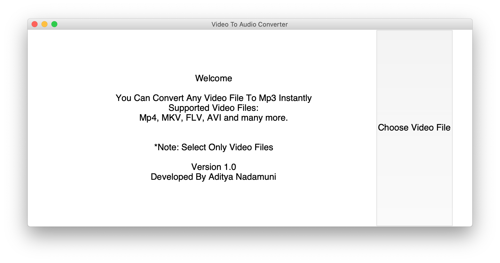
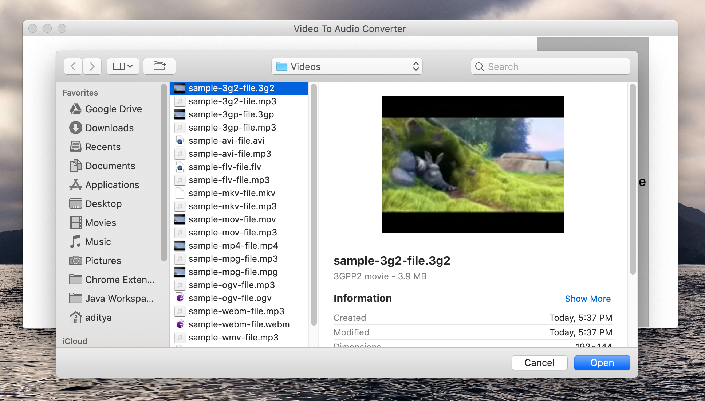
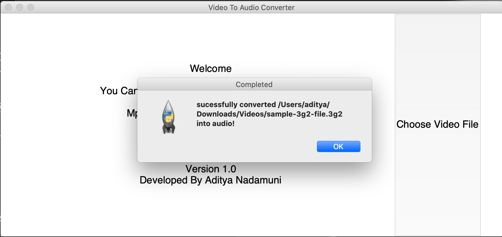
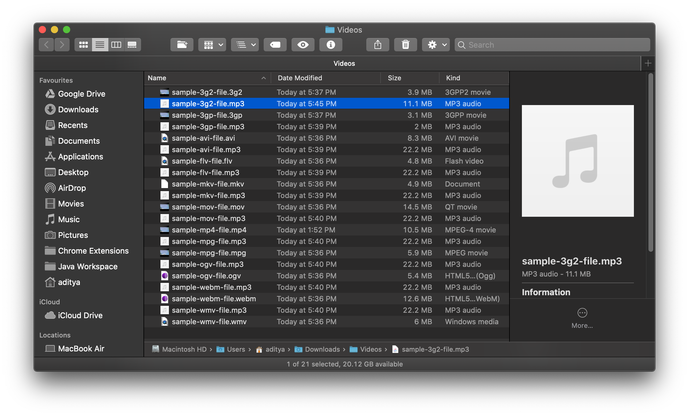

# Video to Audio Converter 🎬 🎵

> Have a Collection Of Favorite Video Songs?
> Hate To Download Music Files Seperately
> Dont Want To Download Through Sketchy Sites ?
> Then Video To Audio Converter is The Way To Go As It Offers a Simple Approach and Easily Convert Your File in A Click !!
> Stable Build For Windows Available
> App For MacOS Coming Soon.



## Installation

**Windows**:

> This Requires Python 3 and pydub, ffmpeg Packages.
> Download as Zip or Clone This Repository to Your Computer.

Install Python:

> Download Python Exe For Your Platform from https://www.python.org/downloads/
> Follow The Instruction Of The Setup.

Install Packages (Pydub, ffmpeg):

> Open CMD and Change Directory to the Downloaded Folder.
> Type The Following Command To Install The Packages.

```sh
pip install -r requirements.txt
```

**MacOs**: (Coming Soon)

> MacOS Version is Under Development !!

## How To Use

> **1) Open The Application:**
> Navigate to Dist/Video To Audio Converter Folder.
> Open The **Video To Audio Converter (V 1.0) (Windows).exe**


> **2) Click Choose Video File Option**
> Open the Required Video File Of Any Supported Format Through Dialog Box.



> **3) Wait For The Magic To Happen**
> Wait For The Result as The Magical Script Runs in The Background !!.



> **4) Find Your File**
> After Greeted With Message Find Your Mp3 File in The Same Directory and Enjoy !!



## Features

> Can Convert Any Video File into Mp3 in Few Seconds and Its Also Hassle Free.
> Also This Program is Light Weight.
> Easy To Use.
> Removes The Headache to Find The Perfect or Safe Site To Download The Exact Same Audio File.
> Saves Time.

## Why MP3 Format?


> MP3 (or mp3) as a file format commonly designates files containing an elementary stream of MPEG-1 Audio or MPEG-2 Audio encoded data, without other complexities of the MP3 standard.
> Also Supported By Many Devices !!

_For more information, please refer to the [Wiki][wiki]._

## Release History

- 1.0
  - Initial Stable Build
- 0.1
  - Work in progress

<!-- Markdown link & img dfn's -->

[wiki]: https://en.wikipedia.org/wiki/MP3
